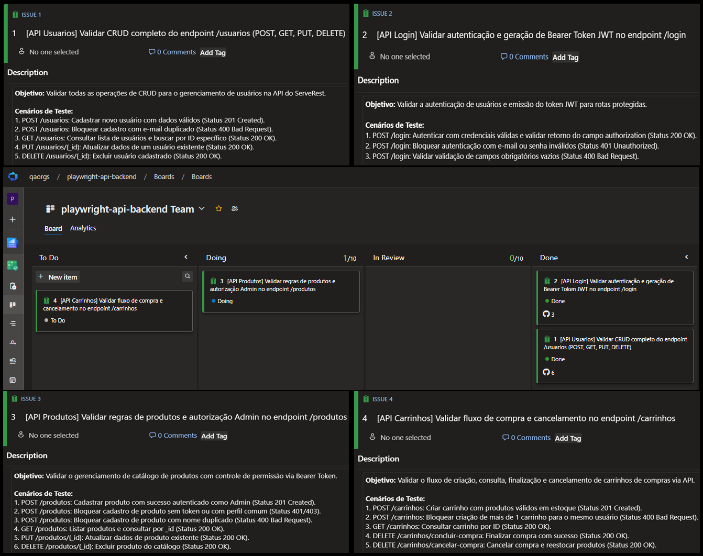

# Playwright API Backend - Automação de Testes de API REST

Projeto de automação de testes de **API REST (Backend)** na aplicação **ServeRest**, construído nativamente com **Playwright (`APIRequestContext`)** e **TypeScript**, integrado à gestão ágil no **Azure DevOps (Boards)** e com mapeamento exploratório e documentação viva da API via **Postman**.

## Objetivo

Garantir a integridade, conformidade dos contratos HTTP, regras de negócio e controle de autorização (RBAC via Bearer Token JWT) nos endpoints centrais da aplicação ServeRest (`/usuarios`, `/login`, `/produtos` e `/carrinhos`).

## Tecnologias e Ferramentas

- **Playwright** (`@playwright/test` - `APIRequestContext`)
- **TypeScript** & **Node.js**
- **Postman** (Mapeamento exploratório e documentação viva de API)
- **Azure DevOps (Boards)** (Planejamento ágil, Kanban e rastreabilidade com Work Items `AB#ID`)
- **Git / GitHub** (Integração contínua e rastreamento de commits/PRs no Azure Boards)

## Gestão Ágil e Rastreabilidade (Azure DevOps + GitHub)

O planejamento, especificação dos requisitos e ciclo de vida de desenvolvimento e testes foram gerenciados no **Azure DevOps (Boards)** integrado ao repositório no **GitHub**:

- **Rastreabilidade por Work Item:** Cada branch e Pull Request faz referência direta ao ID do card no Azure DevOps (ex: `feat/AB#1-crud-users`, `feat/AB#2-auth-jwt-login`, `feat/AB#3-crud-products` e `feat/AB#4-carts-flow`).
- **Vinculação e Fechamento:** Uso da tag `Fixes AB#ID` nas descrições de Pull Request, registrando commits e merges diretamente na aba *Development* dos Work Items.
- **Workflow Kanban:** Transição de etapas do fluxo ágil através das colunas `To Do` ➔ `Doing` ➔ `In Review` ➔ `Done`.

### Quadro Kanban e Especificação dos Cards no Azure DevOps



## Documentação Viva da API (Postman Collection)

Como parte do processo de garantia da qualidade, todos os contratos de requisição e resposta foram previamente mapeados e validados no **Postman** antes da codificação dos scripts automatizados.

A collection formatada completa está versionada na raiz do repositório:
- 📄 [`playwright-api-backend_postman-collection`](./playwright-api-backend_postman-collection)

## Cenários de Teste Automatizados

A suíte completa possui **19 cenários automatizados** em TypeScript distribuídos por módulos de recurso:

### 1. Gestão de Usuários (`tests/users.spec.ts` - Card `AB#1`)
| Cenário | Método / Rota | Status Esperado | Validações Principais |
| :--- | :--- | :--- | :--- |
| **US01** | `POST /usuarios` | `201 Created` | Mensagem de sucesso e geração de `_id` único |
| **US02** | `POST /usuarios` | `400 Bad Request` | Bloqueio de e-mail duplicado (`"Este email já está sendo usado"`) |
| **US03** | `GET /usuarios/{_id}` | `200 OK` | Busca de usuário específico e conferência de dados |
| **US04** | `PUT /usuarios/{_id}` | `200 OK` | Atualização cadastral (`"Registro alterado com sucesso"`) |
| **US05** | `DELETE /usuarios/{_id}` | `200 OK` | Exclusão do usuário (`"Registro excluído com sucesso"`) |

### 2. Autenticação e Token JWT (`tests/login.spec.ts` - Card `AB#2`)
| Cenário | Método / Rota | Status Esperado | Validações Principais |
| :--- | :--- | :--- | :--- |
| **US01** | `POST /login` | `200 OK` | Login de admin com sucesso e validação de token `Bearer` via regex |
| **US02** | `POST /login` | `401 Unauthorized` | Bloqueio por credenciais incorretas (`"Email e/ou senha inválidos"`) |
| **US03** | `POST /login` | `400 Bad Request` | Validação de campos obrigatórios vazios |

### 3. Catálogo de Produtos e RBAC (`tests/products.spec.ts` - Card `AB#3`)
| Cenário | Método / Rota | Status Esperado | Validações Principais |
| :--- | :--- | :--- | :--- |
| **US01** | `POST /produtos` | `201 Created` | Cadastro de produto com perfil Administrador autenticado |
| **US02** | `POST /produtos` | `403 Forbidden` | Bloqueio para usuário não administrador (`"Rota exclusiva para administradores"`) |
| **US03** | `POST /produtos` | `400 Bad Request` | Bloqueio de produto com nome duplicado |
| **US04** | `GET /produtos` & `GET /produtos/{_id}` | `200 OK` | Validação da listagem geral e busca por ID |
| **US05** | `PUT /produtos/{_id}` | `200 OK` | Atualização com validação estrutural via `toMatchObject` |
| **US06** | `DELETE /produtos/{_id}` | `200 OK` | Exclusão de produto por usuário administrador |

### 4. Ciclo de Carrinhos e Gestão de Estoque (`tests/carts.spec.ts` - Card `AB#4`)
| Cenário | Método / Rota | Status Esperado | Validações Principais |
| :--- | :--- | :--- | :--- |
| **US01** | `POST /carrinhos` | `201 Created` | Criação de carrinho associando produto e usuário autenticado |
| **US02** | `POST /carrinhos` | `400 Bad Request` | Bloqueio de múltiplos carrinhos para o mesmo usuário |
| **US03** | `GET /carrinhos` & `GET /carrinhos/{_id}` | `200 OK` | Validação da listagem geral e detalhes do carrinho |
| **US04** | `DELETE /carrinhos/concluir-compra` | `200 OK` | Conclusão da compra, exclusão do carrinho (`400`) e decremento no estoque do produto |
| **US05** | `DELETE /carrinhos/cancelar-compra` | `200 OK` | Cancelamento da compra, exclusão do carrinho (`400`) e reabastecimento do estoque |

## Destaques Técnicos de Arquitetura

- **Autonomia Total de Massa de Testes:** Uso de função auxiliar geradora combinada com `counter.json`, garantindo dados únicos a cada requisição e isolamento completo sem interferência entre workers paralelos.
- **Validação de Efeitos Colaterais no Backend:** Verificação direta de alterações de estoque e remoção de registros em cascata após operações de compra/cancelamento.
- **Validação Avançada com `toMatchObject`:** Assertions semânticas e elegantes de objetos complexos e payloads de resposta.
- **Execução Multi-Browser Nativa:** Execução de todos os 57 testes em paralelo em Chromium, Firefox e WebKit via Playwright Test Runner.

## Estrutura do Repositório

```text
├── docs/
│   └── assets/
│       └── print-azure-details.png            # Evidência do Azure DevOps Boards e Cards
├── tests/
│   ├── users.spec.ts                          # Testes de CRUD de Usuários (AB#1)
│   ├── login.spec.ts                          # Testes de Autenticação e JWT (AB#2)
│   ├── products.spec.ts                       # Testes de Catálogo e RBAC (AB#3)
│   └── carts.spec.ts                          # Testes de Carrinhos e Estoque (AB#4)
├── counter.json                               # Contador incremental para geração de massa
├── playwright-api-backend_postman-collection  # Collection do Postman (Documentação viva)
├── playwright.config.ts                       # Configuração global de execução do Playwright
├── tsconfig.json                              # Configurações do compilador TypeScript
├── package.json                               # Dependências e scripts do Node.js
└── README.md                                  # Documentação principal do projeto
```

## Pré-requisitos

- **Node.js** (versão 18 ou superior)
- **NPM**

## Como Executar os Testes

1. **Clonar o repositório:**
   ```bash
   git clone git@github.com:giovanemedeiros/playwright-api-backend.git
   cd playwright-api-backend
   ```

2. **Instalar as dependências:**
   ```bash
   npm install
   ```

3. **Executar todos os testes de API:**
   ```bash
   npx playwright test
   ```

4. **Executar um arquivo de teste específico:**
   ```bash
   npx playwright test tests/carts.spec.ts
   ```

5. **Visualizar o relatório detalhado em HTML:**
   ```bash
   npx playwright show-report
   ```
